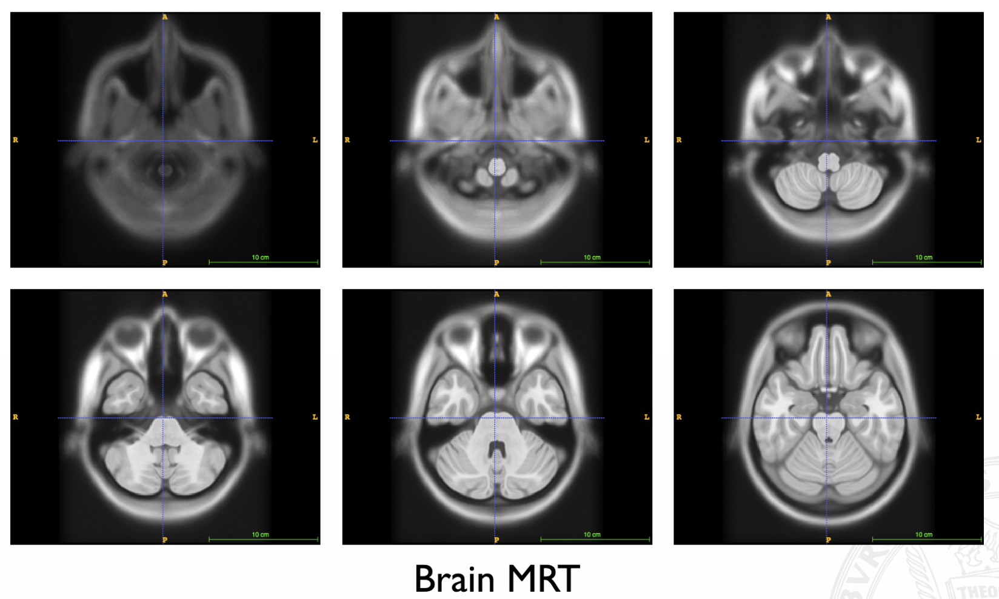
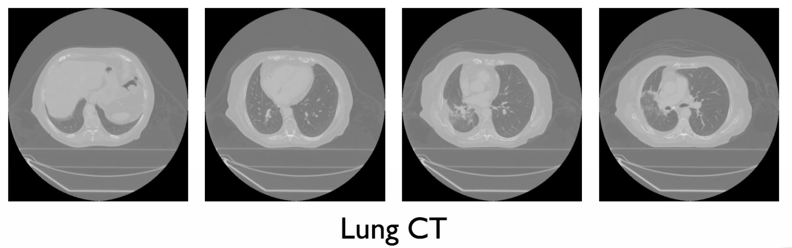
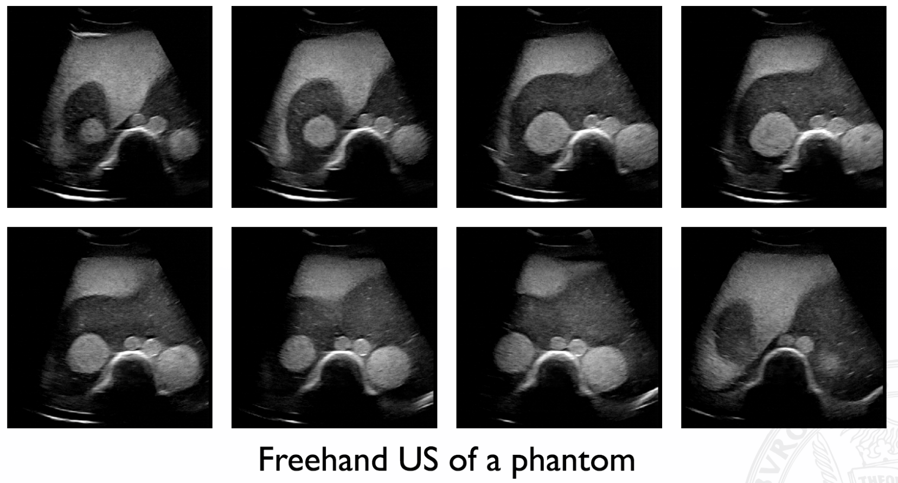
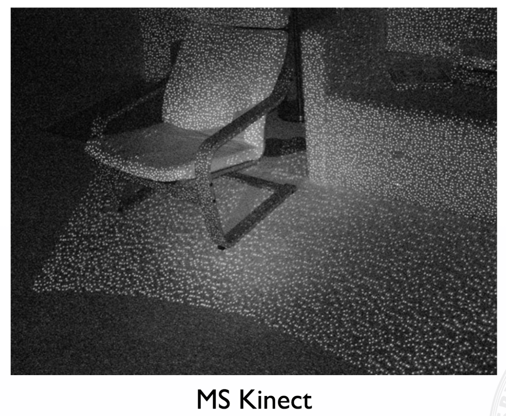
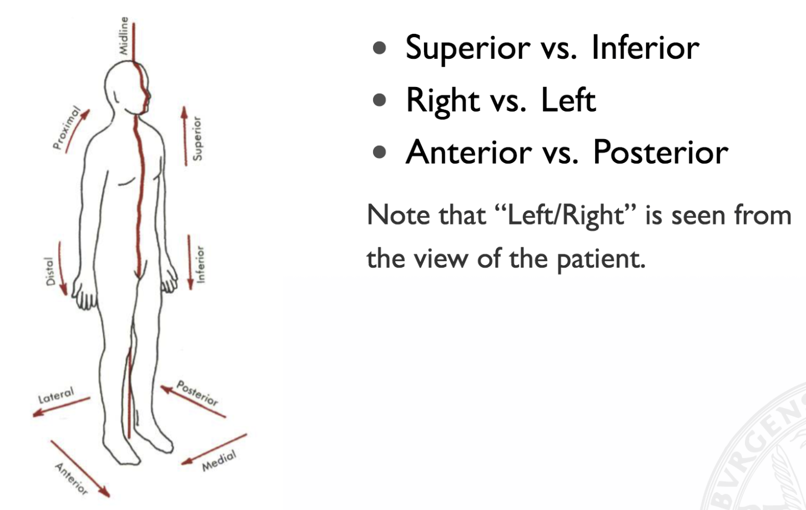
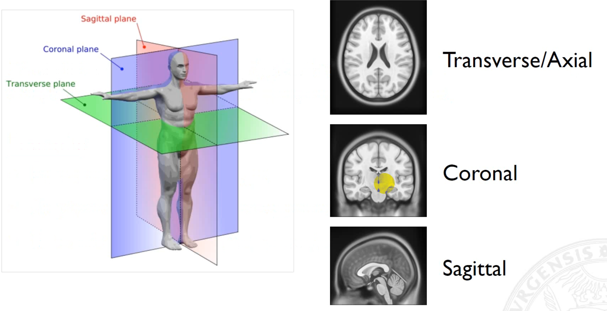
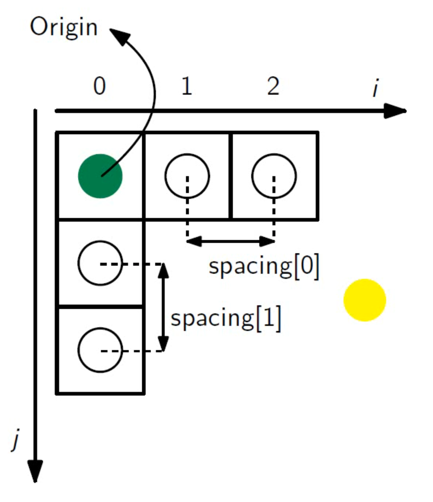

# Preliminaries

Topics covered in this lecture:

- Radiography (X-Ray & CT)
- Magnetic Resonance Tomography (MRT)
- Ultrasound
- Time-of-Flight (ToF)
- Structured Light
- LIDAR

In other words, this lecture is about imaging modalities __beyond typical "consumer electronics"__.

### Imaging Modalities

**Magnetic Resonance Tomography**

__Note:__ Physical environment (temperature, scanner parameters, etc.) has a huge impact on the captured image. This might result in totally different images of the same person.

**Computer Tomography**

__Note:__ Captured by "rotating X-Ray".

**Problem with CT:**  
Ionizing ("ionisierend") radiation is typical used for "bone-like" structures. It's hard to differentiate between many different tissue types. MRT performs much better in these types of scenarios.

**Ultrasound**

**Structured Light**

We get two different types of information:   
- Point Cloud  
- Depth Map

### Intensity values

Intensity values are related to physical tissue characteristics.  
So, we can say that the actual voxel value in medical imaging has more meaning that in standard imaging.

### Anatomical Orientations

Orientations are typically encoded in a three letter code. We need to be really careful since different images often have totally different letter codes!

**The code always describes to positive direction of each axis!**  

**Example: RAS**  
R: x-axis from left to right  
A: y-axis from posterior to anterior  
S: z-axis from interior to superior  

**Imaging Planes**  
  

**Coordinate Space**

We have multiple coordinate systems:

- **World:** How the patient was "lying" within the scanner.
- **Anotomical:** Coordinate system with respect to the planes
- **Image:** Coordinate system of the image

**Note:** In some cases we have to go back from the image coordinate system to the world coordinate system. For instance, if we have a robot which operates a patient (e.g. rain surgery)

**Image Origin**  
Position of the first voxel in the anatomic coordinate space.

origin = [100mm, 50mm, -10mm]

**Voxel spacing**  
Distance between voxel.

spacing = [1mm, 1mm, 0.9mm]

**Note:** If want to see a lot of details (very small structures), we need a fine spacing. Otherwise we are not able to capture all the details.

### What's a imaging phantom?
Imaging phantom, or simply phantom, is a specially designed object that is scanned or imaged in the field of medical imaging to evaluate, analyze, and tune the performance of various imaging devices. For example, we can use a phantom to calibrate your device.

