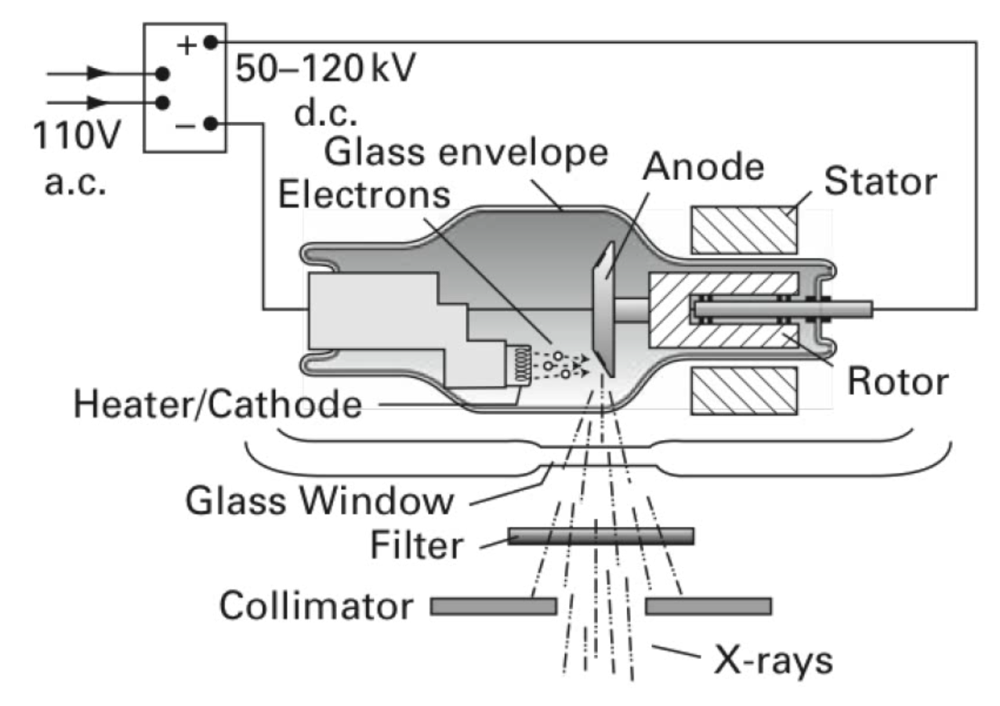
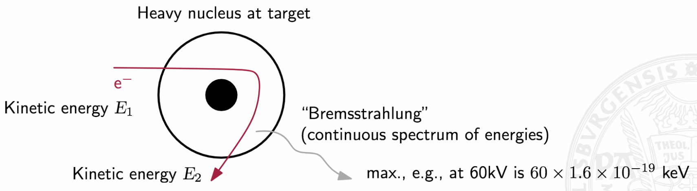
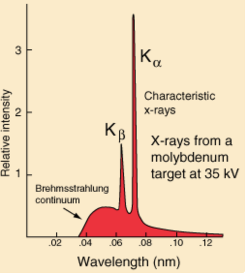
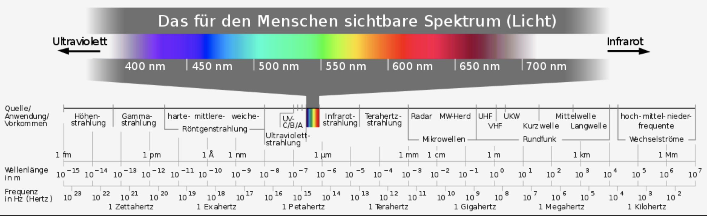
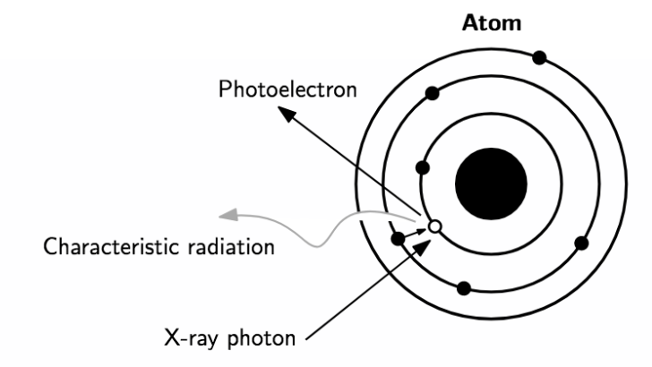
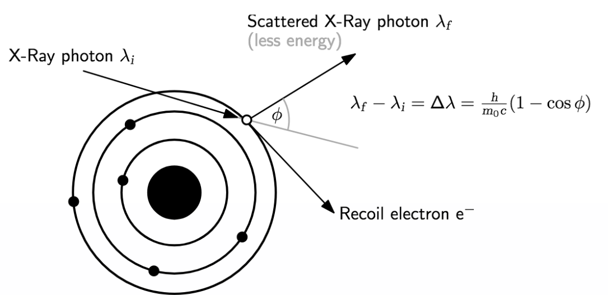
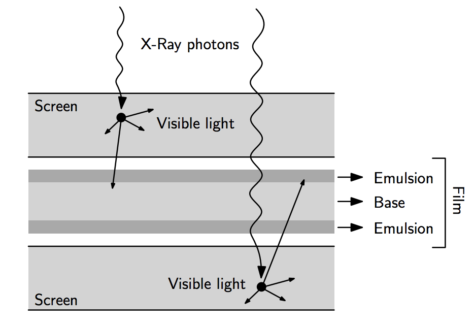
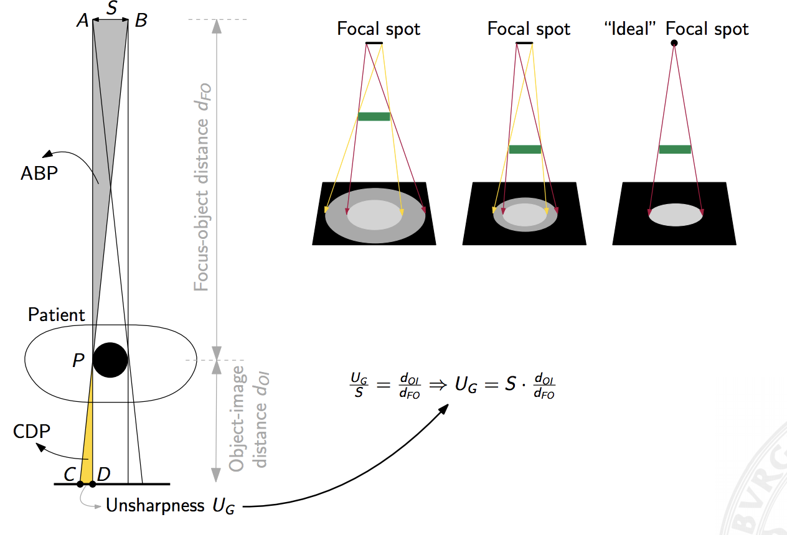
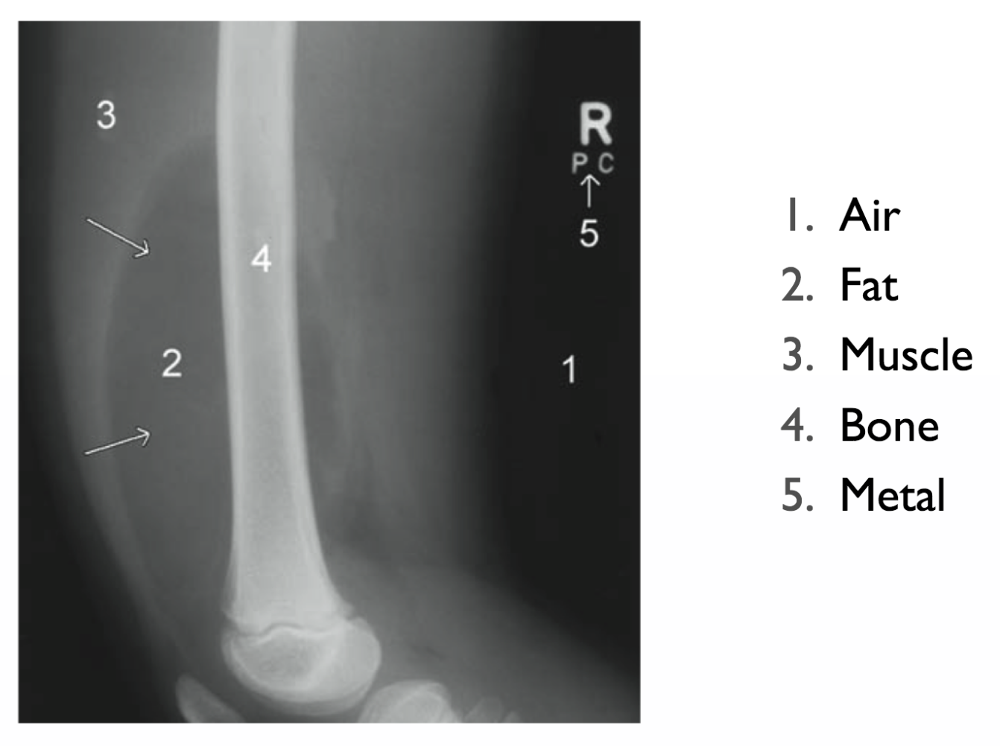

## Radiography (X-Ray Imaging)

### Basic Principle

We have an x-ray tube that "shoots out" radiation (photons in a very specific frequency range). The wavelength is extremely short, way shorter than the wavelength of visible light.

X-rays touch and interact with the human body / tissue ("Gewebe"). Some of the x-rays then get absorbed (bad!) while others travel through (with reduced intensity).  
The x-ray image itself shows the amount of attenuation ("Abschwächung") of the initial x-ray beam(s). Since different types of tissues (bone, air, etc.) have different attenuation coefficients, we can use the attenation of the signal to conclude what type of material we have to deal with.

**Visual appearance**  
Less dense tissue (e.g. air) --> Less attenuation --> darker appearance  
**Therefore air is black!** See CT where a major part of the image is black.

### Problem with Radiography

We cannot differentiate between *soft* tissue.  

**What about mammography, isn't it x-ray based too?**  
In breast imaging we only have to deal with soft tissue. Unfortunately, the higher the energy of our x-ray beams, the less we are able differentiate between different tissue types. Therefore, we use low energy beams for mammography. Unfortunately, this has the affect that more radiation is absorbed by the tissue as well. And that's obviously bad!

**Note:** X-Ray technology is cheap compared to other approaches. That's why it often favoured.

### Sketch of the working principle

**Note:** The filament is typically made of tungsten ("Wolfram")

**Process description:**

1. Apply voltage to the system
2. Atoms start to vibrate + electrons start to move. This causes the wire (filament) to heat up.
3. At some point the electrons will have so much cinetic energy that they "jump out" of filament and move towards the anode due to the potential difference
4. Radiation gets produced as soon as the electrons hit the material

**Note:**  
- The filter is used to get rid of the low energy x-ray photons which are really bad for the human body.  
- The collimator is used to focus the x-ray beam.

### How do x-ray photons get generated?

We now understand the basic working principle of x-ray scanners and how they make electrons travel towards the anode. However, keep in mind that no x-ray beams have been generated yet.  
So, the question that remains is obviously at which stage the x-ray beams are produced.

To understand this, we need to take a closer look at the anode that is hit by the electrons.  
Once an electron hits the material it gets slowed down / completely stopped by the forces of any atom it encounters. If the electron is slowed down, it will exit the material with less energy. This is what is called **"Bremsstrahlung"**.  

However, the law of conservation of energy tells us that energy cannot simply be lost. Hence, then energy absorbed by the atom must be converted to another form of energy. Hence, the energy used to slow down the electron is excessive to the atom and the energy will be radiated as x-radiation of equal energy.

**If the electron is completely stopped by the strong positive force of the nucleus, the radiated x-ray energy will have an energy equal to the total kinetic energy of the electron.**

**Note:** To get the maximum numer of x-ray photons, the electrons need to travel very close to the atoms. So, converting ALL electrons into x-rays is rather unlikely.

However, the "Bremsstrahlung" is not the only way how x-ray photons get generated!  
Another type of radiation is called **characteristic radiation**. Therefore, let's take a closer look at the atoms and its shells.

Once the electron hits the atom, it might eject an electron from one of the shells. Meaning that it hits the electron and the electron gets removed from the shell. What remains is a vacancy (free spot) in the shell. At this point the atom is also called "ionized". Now, an electron from the outer shell falls into the inner shell. This process produces x-ray photons.

The amount of energy that is generated is heavily dependent on the material (tungsten, etc.) and the initial energy level.

We can now plot an intensity diagram which will look as follows:

If we increase the current, the more the wire heats up and the more electrons get freed.  
The voltage controls how many electrons hit the "target". If we increase the voltage only, the intensity will increase, but the shape should remain almost the same.

**Note:**  
- Smooth part: Caused by "Bremsstrahlung"  
- Peaks: Caused by characteristic x-ray

### Example:

Let's compute the wavelength of an x-ray photon with 60keV.

1. Compute energy of the photon  
   $E = 1.6 \cdot 10^{-19} \cdot 60000 = 9.6 \cdot 10^{-15} \frac{kg \cdot m^2}{s^2}$
2. We know that E = hf where h is the Planck constant  
   $h = 6.626 \cdot 10^{-34} \frac{kg \cdot m^2}{s}$  
   $f = \frac{E}{h} = 1.44 \cdot 10^{19} Hz$
3. Let's compute the wavelength  
   $f = \frac{c}{\lambda} = 0.02 nm$
   
**Note:** The wavelength is significantly smaller than the one of visible light (400nm - 700nm). That's also why x-ray penetrates the human body and visibly light does not.

   
   
### Interaction with the human tissue

Now, we understand how the x-ray photons are generated. What remains is the question how we can use x-ray to obtain an image of a patient.  
Therefore, let's imagine that the x-ray photons arrive at the human tissue with a specific intensity value ($I_{0}$). Once, the photons travel through the tissue they get attenuated. The amount of **attenuation** is **dependent on the tissue type** and the **material thickness**.

$I = I_{0} \cdot e^{-\mu \cdot t}$  

$\mu$ ... Attenuation coefficient  
$t$ ... Material thickness

**Bone:** High attenuation coefficient  
**Musle, Fat:** Low attenuation coefficient

### What causes the attenuation?

The intensity gets attenuated mainly because of two effects:

- **Photoelectric absorption**  

  

  The tissue absorbs the x-ray beam and the energy of the photon is transfered to the electron which is ejected and a positively charged atom (ion) remains. The ejected electron goes away as a "photoelectron". The whole energy of the x-ray photon gets absorbed by the body and the atom remains ionized (bad)!
  
  
- **Compton Scattering**  

  
  
  The x-ray photon ejects an outer shell electron and looses energy. It's deflected and travels further. The reduced energy means greater wavelength. Again, an ionized atom remains!  
  
Both, photoelectric absorption and compton scattering contribute to $\mu$, as $\mu = \tau + \sigma$.

$\tau = \rho \frac{Z_{eff}^{3}}{E^3}$  ... relates to photoelectric absorption  
$\sigma = \frac{\rho}{E}$ ... relates to compton scattering

where  
$Z_{eff}$ ... effective atomic number  
$\rho$ ... electron density

Dependent on the "type" of atom (tissue) we hit, we get different types of absorption.

**Note:**  
- Photoelectric absorption: decays cublicy with the amount of energy  
- Compton scattering: decays linearly with the amount of energy

Therefore, it we can see that for certain tissue types photoelectric absorption is more important than compton scattering and vice versa.

**Interpretation:**  
If a high energy beam hits bone (high effective atomic number), the beam will basically travel through and only a small amount of energy gets attenuated due to compton scattering.  
If a low energy beam hits the bone, most of the energy will be absorbed.

If we compute the mean, we will notice that the mean will shift as the low energy part is mostly absorbed. This effect is also called **beam hardening**. So, for bone the mean energy will be higher than the mean energy before.

### How can we differentiate between soft tissue types?

X-ray is very bad at capturing soft tissue types (it's not possible to differentiate between them). However, there are a few tricks we can apply.

Let's take a look at the following initial energy levels and the corresponding attenuation coefficients.

| **Max energy** | **$\frac{\mu}{cm}$ Bone**  | **$\frac{\mu}{cm}$ Muscle** |
| :------------: | :-------------------------:| :--------------------------:|
|     4 MeV      |          0.087             |          0.049              |
|    100 keV     |          0.60              |          0.21               |
|     50 keV     |          3.32              |          0.54               |

If we compare the values above, we immediately notice that there's a huge difference between muscle and bone in the 50keV case. This will also be true for other soft tissue types (e.g. muscle, fat). We can now use this fact for breast imaging (no bones, only soft tissue).

In real world the initial energy is not fixed, but rather shifted within a certain range.  
e.g. chest x-ray: 100keV - 500keV

**Note:**  
- We never use a breast x-ray to capture bones! As the attenuation coefficient is very high for bone it would mean that we expose the body to an enormous amount of radiation.  
- We also need to take the size of an object into account.

### Detector types

- Film-screen radiography (e.g., chest, abdominal, mammography)
- Computed radiography (storage phosphors replace film)
- Digital radiography (semiconductor sensors)
- Fluoroscopy (real-time, using an image intensifier tube)

Sensitivity of photographic film to x-rays is low. Only ≈ 2% of
x-ray photons are captured by film (quantum efficiency)!

Using fluorescent intensifying screen(s) with phosphor particles (inside the screen) converts X-Ray photons into visible light which exposes film. This increases efficiency to ≈ 25%. This is obviously better for patient because we need fewer x-ray photons and thus less dose.

### How to deal with motion artifacts?

It's important to be aware of that fact that, if we ...

- increase the screen thickness, we get a better absorption, but the image quality degrades.
- use a faster screen, we get higher sensitivity, but increased unsharpness.

As already mentioned the beam width (collimator) has an effect on the sharpness. The close the patient moves towards the point source, the better it is.

Think about the camera pinhole model!

### Sample X-ray image

### Mammography

In mammography is achieved with ...

- special tubes operating at 25-30keV
(attenuation is greater → larger contrast differences in soft-tissue)
- replace tungsten with molybdenum targets (to get 15-20keV)
- angle target to achieve small focal-spot size (0.1-0.3mm)
- large focal-spot to film distance (45-80cm)
- compression of the breast (less scatter, more uniform exposure)
- usually, single-emulsion film + one intensifier screen