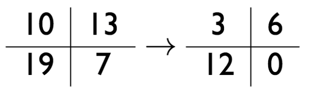
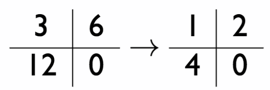

## Computed Tomography (CT)

### What's is CT?

We can say that CT is simply "rotating x-ray around the human body".

Imagine that we have a human body and a x-ray source that rotates around the human body. The detector captures the remaining x-ray beams once they travelled through the body. We now try to compute the backprojection. Since the scanner (source, detector) rotates and the person moves through the scanner we obtain many slices. This slices can then be used to reconstruct the person.

### Idea of backprojection

Let's assume that the scanner rotates around the patient and while it rotates we capture multiple images.  

The angle and the sampling interval determines the resolution of our reconstructed image. The slice thickness is determined by the collimator opening.

However, how can we now create a 3D reconstruction out of multiple 2D images?  
We can used the **backprojection algorithm.**

To understand the backprojection algorithm we need to think about what happens to the x-ray beam when it travels through the body.

The remaining intensity of the x-ray beam once it leaves a certain cell can be computed as follows:

$I_{cell,out} = I_{cell,in} \cdot e^{\mu_{cell} \cdot t}$

So, the intensity once it leaves the human body can be computed as follows:

$I_{out} = I_{cell_{n},in} \cdot e^{\mu_{cell_{n}} t}$  
$I_{out} = I_{cell_{n-1},in} \cdot e^{\mu_{cell_{n-1}} t} \cdot e^{\mu_{cell_{n}} t}$  
$I_{out} = I_{cell_{n-2},in} \cdot e^{\mu_{cell_{n-2}} t} \cdot e^{\mu_{cell_{n-1}} t} \cdot e^{\mu_{cell_{n}} t}$  
...  
$I_{out} = I_{in} \cdot e^{\sum {\mu_{i,j}t}}$

Hence, we get:  
$-log(\frac{I_{out}}{I_{in}}) = \sum{\mu_{i,j}t}$

**So, the measured x-ray intensity depends on the sum of attenuation coefficients.**

**Important:** 

- X-Ray beams are only approximately mono-energetic and attenuation depends on energy  
  **Note:** An x-ray beam consists of many photons. Getting a mono-energetic beam requires all photons to have the same energy level. However, this is not the case in real-world. So, low energy photons will be subject to photoelectric absorption. High energy photons will lose energy and travel further. 

- Effective x-ray energy increases as it passed through patient. "Beam hardening"  
  If the x-ray beam hits bone, most of the low energy stuff will get absorbed. The high energy stuff remains.
 
### Beam hardening

Beam hardening occurs when the mean energy of an x-ray beam increases as it passes through an object / patient.  
This is because of the fact that the beam is not mono-energetic. If a low energy photon hits bone, it gets absorbed. The high energy photons travel through. Therefore, the mean energy will obviously increase.

It turns out that beam hardening leads to dark streaks in images.

**Note:** Lower energy photons are attenuated more easily, higher energy photons are attenuated less easily

  

### Cupping

Cupping means that beams passing through the center are "harded" more than beams passing through edges.

### Backprojection (Simple)

**Idea:** Let's distribute the values over the attenuation / pixel map.

**Problem:** We get a lot of high values! (can also be seen in the example)

**Countermeasures:**

1. Remove the sum in any of the projections (here: 7)  
   
2. Normalize by the highest common factor  
   

   
### How to construct the Hessian Normal Form?

Let's express the following line by the angle $\theta$ and the distance to the normal vector.

Therefore, ...

$cos(\theta) = \frac{l}{m}$ 

$sin(\theta) = \frac{l}{n}$

We also know that: $\frac{x}{m} + \frac{y}{n} = 1$

Hence, we can describe our line as follows: $x \cdot cos(\theta) + y \cdot sin(\theta) = l$

### Radon Transform 

We will now see that we can use the Hessian normal form to come up with the backprojection formula.  

Now let's imagine that we have one, very thin x-ray beam that travels through our object until it hits the detector.  
In the following draw the green line represents the x-ray beam, while the gray line represents the detector. 

So, to compute the value of the function $g(I,\theta)$ for a certain I and $\theta$, we compute the line integral. 

$g(I,\theta)=\int_{-\infty}^{\infty} \int_{-\infty}^{\infty} f(x,y) \cdot \delta(x \cdot cos(\theta) + y \cdot sin(\theta) - I) \cdot dx dy$

$\delta$ ... 1 if point (x,y) is on the line, otherwise 0

In other words, ...

- if we fix l and $\theta$, we compute the line integral of f(x,y)
- if we fix $\theta$, we compute the projection of f(x,y) at angle $\theta$

$g(\cdot,\cdot)$ is the Radon transform of f(x,y)
 
 
### Backprojection

**Variant 1**

$g(l,\theta)$ is only measured at certain l. This *coarse sampling* results in many points being unassigned.  
This is bad (we might get grid effects). Therefore, it's common to *apply interpolation*.

Basically this what we did in the example before.

**Variant 2**

For each angle we want to compute, we go through all the sampling points in the image and find the corresponding l.  

$b_\theta = g(x \cdot cos(\theta) + y \cdot sin(\theta), \theta)$

$f_b(x,y) = \frac{1}{\pi} \int_0^\pi b_\theta(x,y) \cdot d_\theta = \frac{1}{\pi} \int_0^\pi g(x \cdot cos(\theta) + y \cdot sin(\theta),\theta) \cdot d_\theta = \frac{1}{\pi} \int_0^\pi [g(l,\theta)]_{l=x \cdot cos(\theta) + y \cdot sin(\theta)} d_\theta$

**Note:** Since $g(l,\theta)$ is only measured at certain l, we need to interpolate

$f_b(x,y)$ is the **backprojection summation** image.

### Hounsfield units (HU)

We know that our sensor measures energy of photons. Since the energy's range of values is usually really large, we typically have problems to visualize the results. Therefore, we want to apply some kind of normalization.

This is done by Hounsfield units which measure the result with respect to something we know (e.g. attenuation of water).

By doing that we can:

- Minimize the dependence on the energy of x-ray beams
- Produce unit-less values

$HU = 1000 \cdot \frac{\mu - \mu_{H2O}} {\mu_{H2O}}$

**Note:** air = -1000; dense bone = 3000

### Noise and artifacts

__**Quantum noise**__

If multiple photons of different energy levels hit the detector, we obtain slightly varying values. This is also called **quantum noise**.

$SNR = \propto \sqrt{N}$  
N ... number of x-ray quanta/pixel

**Countermeasures:**

- Increase voxel size (reduces resolution)
- Smoothing during reconstruction
- Better quantum efficiency of detector
- "Radiate" longer, but not too long (probably not good for the person ;-)

__**Other effects**__

- Patient motion
- Beam hardening
- Calibration issues
