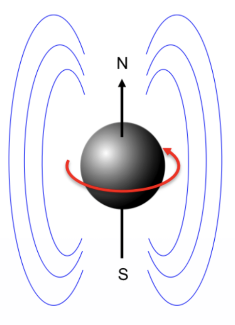
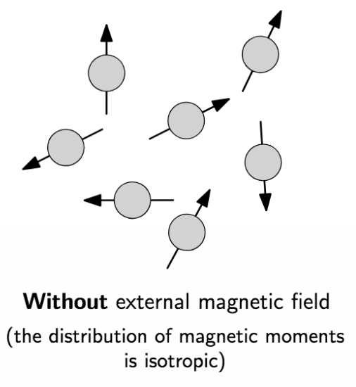
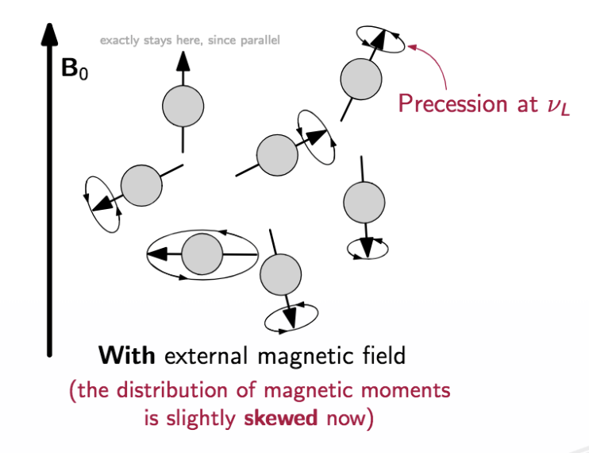
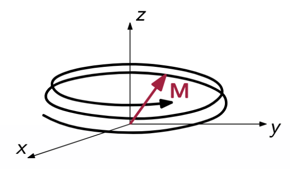
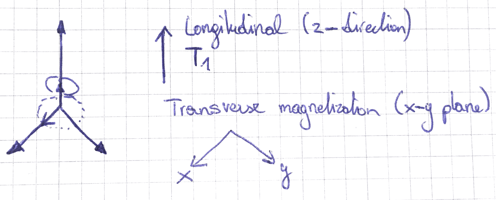
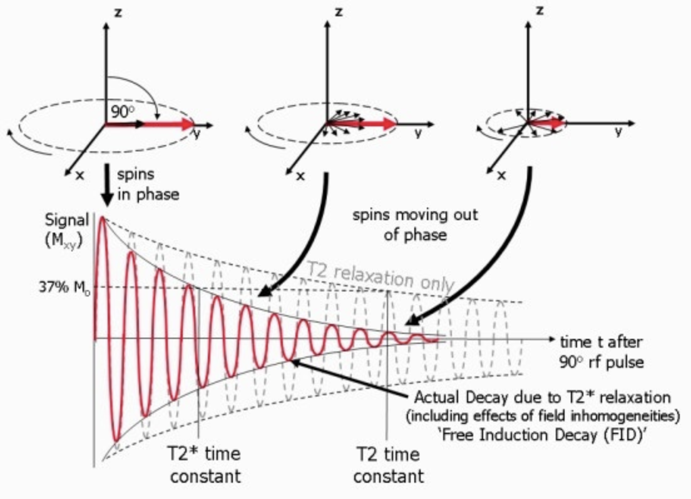
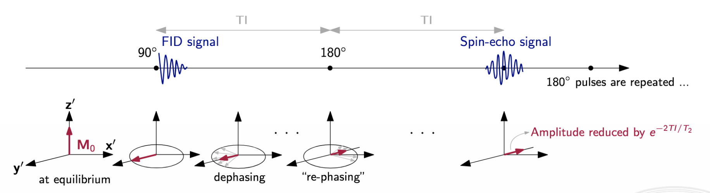
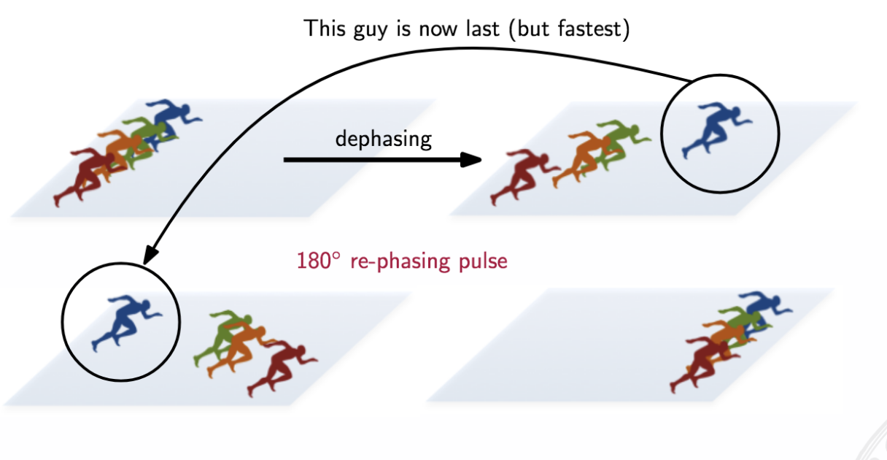
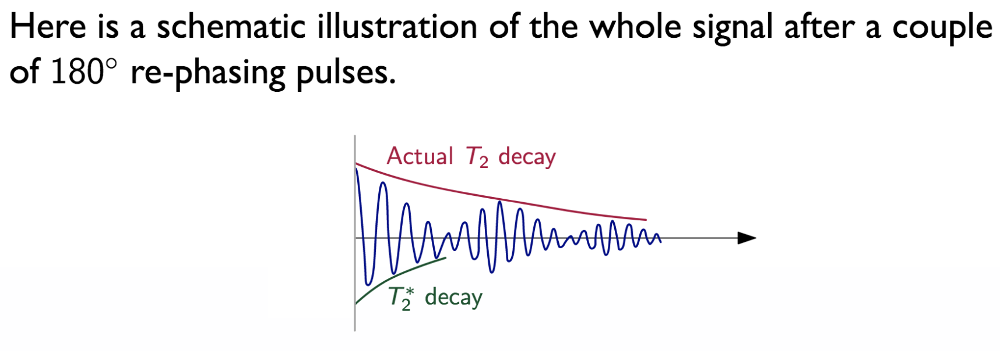

## Magnetic Resonance Imaging

### Structure of atoms

Every atom possesses:

- Mass
- Electric charge
- Magnetism
- Spin

We will know investigate what happens to the hydrogen ($H_1$) atom, which is abundant since the body is mostly made up of water and fat. An hydrogen atom is electrically neutral since it possesses one electron + one proton + no neutron.

In MRI we use a magnet to change the magnetic properties of $H_1$ and try to excite it. This means that we turn on a magnetic field and "things" tend to align with the magnetic field. Once we turn of the impuls, "things" go back into equilibrium state. The time required to go back into equilibrium state is what we measure.

Spin is nothing we can measure directly. Also it's not visible on a microscopic level.  
However, we still know that it is there due to empirical evidence.  
Also it's important not to think about "spin" as something that literally spins. Instead, spin has to be seen as an intrinsic property of a particle. Something that every particle has. In fact, the name spin is misleading and the name "intrinsic angular momentum" would fit better.

Furthermore, every nucleus has an orientation which can be seen as the orientation direction of the spin. This can also be seen as a polarization direction.

Furthermore, each nucleus acts as like a little magnet. If we considered all nuclei of a substance, we would see that the distribution of the polarization directions is totally random.

### Effect of external magnetic fields

Let's say that we now turn on an external magnetic field $B_0$ with e.g. 1.5T.  
Once it is turned on, the particles start to rotate along the *axis of the external magnetic field*.  
**Note:** The atom itself does not rotate, but everything inside rotates.

This effect is called **precession**.

Precession happens on a specific frequency which depends on the strength of the $B_0$ field and the material. This specific frequency is called the **Larmor frequency**.

**Note:** The Larmor frequency is in the radio-frequency range.

Additionally, it's important to understand that even if we turn on the external magnetic field nothing happens to the orientation direction of the particles. They remain randomly distributed. Only after a while (a couple of nanoseconds) the majority (not all) start to orientate towards the external electromagnetic field lines of $B_0$. This is possible due to thermal reasons and other quantum magnetic effects.
Once this re-orientation has happend we are in the so-called **thermal equilibrium state**.

The reason why the start orientate towards $B_0$ (upwards) because the try to move towards the direction of the lower energy state. However, this longitudinal magnetization is so small to be measured directly.

Since every particle acts as a little magnet and they are now all rotated towards the lower energy state, the magnetization adds up. This magnetic field is also called $M_0$.

If the external magnetic field gets turned of, then the orientation becomes random again and the magnetization gets lost.

### How to measure the magnetization

Unfortunately, the magnetization $M_0$ is too weak to be measured directly. However, we can measure it by means of a trick. Let's try to take the net magnetization vector $M_0$ and flip it to the x,y - plane.

This can be achieved by a second magnetic field $B_1$ that rotates exactly at the Larmor frequency. It's often called a **90 degree pulse**.  
Since the magnetic field rotates at the Larmor frequency we get resonance (nuclear magnetic resonance).

**Note:** $B_1$ is much weaker than $B_0$.

If we now turn $B_1$ off, the particles will rotate back to the equilibrium state.  
This movement can be seen as an upward spiral. While it moves back also the vector will become shorter.

We can now consider the following two times:

- $T_1$  
  The longitudinal relaxation time measures how long it takes for the z-component of M to "grow back" along Z
- $T_2$  
  The transversal relaxation time measures the decay of transversal magnetization.
  
We can use a 90 degree pulse to measure $T_2$ or a 180 degree pulse to measure $T_1$.

Nevertheless, in practice we will rarely see $T_2$, but $T_2*$. This is caused by the fact that other physical (thermal) effects (different room temperatures) have an impact too. Therefore, we often use a sequence of pulse (90, 180, 90, etc.) depending on what we want to measure.

### Advantages and disadvantages

With MRI imaging ...

- we get high-resolution information of anatomic structures (CT: 1 x 1 x 1 / MR: 0.3 x 0.3 x 0.3)
- we get high-contrast for soft-tissue types
- we have no exposure to radiation

However,

- we have more complicated instrumentation
- scan acquisition takes longer (problem with patient motion)
- precautions must be taken to keep metal objects away
- imaging is expensive (acquisition, maintenance, operation)
 
### How to measure spin

Spin typically comes in multiples of 1/2 and can be positive or negative. For example, $H_1$ has a spin of 1/2.  
This because of the fact that, for instance, protons consist of three quarks (2x up-quark, 1x down-quark). The spins of each quark sum of to 1/2.

Particles with a spin of q=1/2 have **(2q+1)** energy sublevels.

### Maths behind MRI

If we turn on our external magnetic field, the energy of the nucleus is  
$E = -<\mu,B_0>$  where $\mu$ is the magnetic moment.

Since Hydrogen $H_1$ has two different energy levels, the question that arises is what is the difference between these two energy levels.

In general, for the z component of $\mu$ we have  
$\mu_z = \gamma \cdot m \cdot h$  
where $\gamma$ is the gyromagnetic ratio, m is the magnetic quantum number and h the Planck constant.

By convention, we consider an external magnetic field $B_0$, aligned with the z-direction.  
Therefore, we get for the energy: $E_m = - \mu_z \cdot B_0 = - \gamma \cdot m \cdot B_0 \cdot h$

For example, for $H_1$, i.e., m=1/2:

$E_{+1/2} = - \gamma \cdot 1/2 \cdot B_0 \cdot h$  
$E_{-1/2} = + \gamma \cdot 1/2 \cdot B_0 \cdot h$

Consequently,  

$\Delta E = \gamma \cdot h \cdot B_0$, or

$\Delta E = \gamma \cdot h \cdot B_0 = h \cdot \frac{\gamma}{2 \pi} \cdot B_0 = h \cdot v_L$

$v_L$ is referred as the Larmor frequency.

So, in order to overcome this energy difference, we need to "bring in" exactly the same amount of energy. Then the energy levels will change.

**Time derivatives of the net magnetization**

$\frac{d}{dt}M = \frac{d}{dt}\sum_i{\mu_i} = \sum_i{\frac{\mu_i}{dt}} = \sum_i{\gamma(\mu_i \text{ x } B)} = \gamma ( M \text{ x } B )$

$M_0$ is also called the net magnetization.

By splitting it up into individual compontents (cross product) we get:

$\frac{d}{dt}M_x = \gamma(M_y \cdot B_z - M_z \cdot B_y)$  
$\frac{d}{dt}M_y = \gamma(M_z \cdot B_x - M_x \cdot B_z)$  
$\frac{d}{dt}M_z = \gamma(M_x \cdot B_y - M_y \cdot B_x)$

However, this is not fully true since our spins are NOT independent from each other. This is not the case (due to thermal effects, etc.) and we need to take care of this effects somehow.

A useful set of equations is called the **Bloch equations** which help us to cope with the problem. For example, this equations take into account interdependencies between spins, etc.

**Derive the final motion equation**

Now, let's assume that $B_0 = \begin{pmatrix} 0 \\ 0 \\ B_0 \end{pmatrix}$.

Therefore, we get for the time-derivative of the net magnetization:

$\frac{d}{dt} M(t) = \begin{pmatrix} \gamma \cdot B_0 \cdot M_y \\ -\gamma \cdot B_0 \cdot M_x \\ 0 \end{pmatrix}$

To solve this we can make use of the fact that we only have motion in x and y. There is no motion in z direction.

Hence, we can say:

$M_{x,y} = M_x + i \cdot M_y$

$B_{x,y} = B_x + i \cdot B_y$

Therefore, ...

$\frac{d}{dt} M_{x,y} = \frac{d}{dt} M_x + i \frac{d}{dt} M_y$  
$\frac{d}{dt} M_{x,y} = \gamma B_0 M_y - i \gamma B_0 M_x$  
$\frac{d}{dt} M_{x,y} = -i \gamma B_0 (M_x - i \cdot M_y)$  
$\frac{d}{dt} M_{x,y} = -i \gamma B_0 M_{x,y}$  
$\frac{d}{dt} M_{x,y} = -i w_0 M_{x,y}$

Let's say that $M_{x,y}(0)$ = $m_0$ (initial magnetization).

Hence, we get:  

$M_{x,y}(t) = M_{x,y}(0) \cdot e^{-i w_0 t} = m_0 (cos(w_0 t) - i \cdot sin(w_0 t))$

Therefore, we finally get ...

$\begin{pmatrix} M_x(t) \\ M_y(t) \\ M_z(t)\end{pmatrix} = \begin{pmatrix} m_0 \cdot cos(w_0 t) \\ m_0 \cdot sin(w_0 t) \\ 0\end{pmatrix}$

with $w_0$ = $V_L$ being the Larmor frequency and $M(0)$ = $m_0$ (initial magnetization).

**Note:** We want $B_0$ to be very large since this leads to greater magnetization which results in a longer vector and therefore it takes more time until we reach the equilibrium state.

### Spin-Echo Sequence

With the things we've learned we can already measure $T_2$ directly. However, there are techniques to achive better results. One is called the Spin-Echo sequence.

We first start with a 90 degree pulse and once we turn it of we measure a little bit of **free induction decay** signal ($T_2$). $M_1$ is tilted in the x,y-plane and rotates there. Now relaxation happens which means that the vectors start to dephase again. Some rotate faster, some rotate slower. Thermal effects cause the vector to move back to equilibrium state.  
After a certain time we send a 180 degree pulse. Therefore, the "vector" flips in the other direction. Due to the 180 degree pulse they start to move together again. They will arrive at the same time. The fastest one before is now the last, but it moves faster.  
If we do this a couple of times, we get a good sampling of how the vector goes back.

