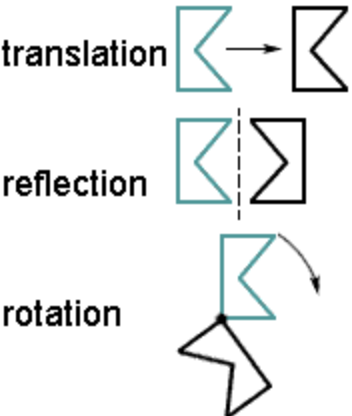
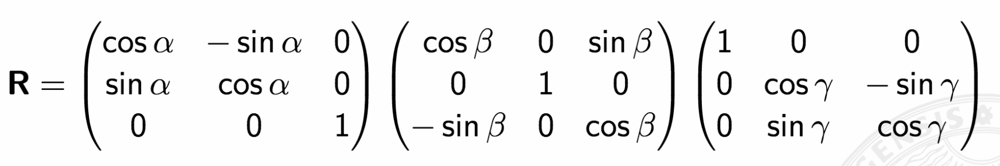
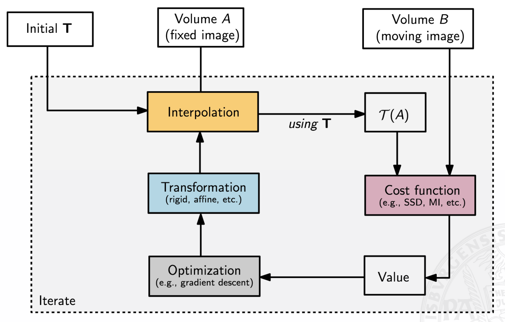
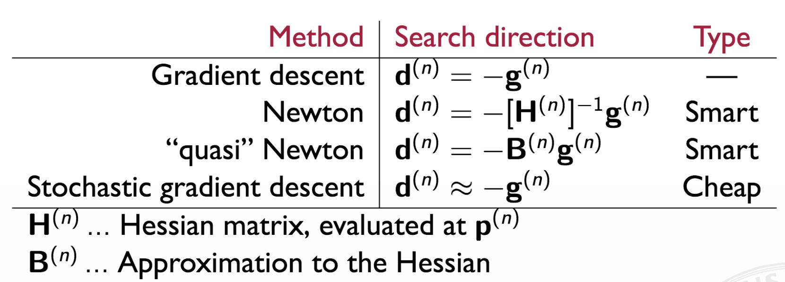

## Image Registration

### Goal

Let' say that we have to images (e.g. images of a human brain).  
We now want to find a transformation T that maps image A to image B.

For instance, this comes in handy if we have an annotated brain ATLAS and a set of new images which are not annotated. By finding the right transformation we can easily annotated the new images.

**Note:** An ATLAS is typically not constructed from a single patient only. Instead images of multiple patients of a certain age group get averaged.

### Rigid Transformation

A rigid transform is a geometric transformation that **preserves distances**.  
It includes **rotations, translations, reflections**.

$x' = Rx + t$

where 

R ... is the rotation matrix  
x ... is a point in $R^2$ or $R^3$  
t ... is a translation vector

and R is an orthogonal transformation ($R^T = R^{-1}$).

Furthermore, we differentiate between **proper** and **improper** transformations.  
A transformation is called **proper**, if the determinante of $det(R)=+1$ which means that it rotates and translates only.  
**Improper** translations can reflect, translate and rotate. In such a case $det(R)=-1$.

We can define a *proper* translations as a concatenation of multiple rotations.

As we can see the rigid transform has 6 parameters. We have 3 degrees of freedom ($\alpha$, $\beta$, $\gamma$) and 3 translation parameters.

**Note:** Rigid transforms which include translation are NOT linear transforms.

In **homogeneous coordinates** we can write a rigid transformation as **one matrix multiplication**.

### Rigid + Scaling Transformation

The simplest non-rigid transformation is rigid + scaling. It's define as follows:

$x' = RSx + t$

with 

$S_x = \begin{pmatrix} r_x & & 0 \\ 0 & r_y & 0 \\ 0 & 0 & r_z\end{pmatrix}$ 

Obviously, distances are not longer preserved.

**Caution:** $x' = SRx + t$ produces a different result. 

In case scaling is isotropic (equal in all dimensions), we speak of a **similarity transform**.

### Affine Transformation

Scaling transformations are special cases of the more general class of **affine transformations**. Affine transformations are defined as follows:

$x' = Ax + t$

where there is no restriction on the elements of A. **Affine transformations** preserve

- straight lines (and hence, the planarity of surfaces)
- parallelism

There is no restriction on A. It can be anything.

### Projective Transformation

The projective transformation can be written as:

$x' = \frac{Ax+t}{<p,x> + \alpha}$.

Only straight lines and planar surfaces are preserved.

### Image Registration

**Algorithm:**

Let's say we have two volumes (images) A and B. Volume A is called the *fixed image* since it does not move. Volume B is called the *moving image* since it's the one we apply the transform on.

1. Take an initial transform and transform volume A (fixed image).  
   Perform interpolation if needed (in case we are not on real integer coordinates).
2. Take a cost function (e.g. sum-of-squared-differences) and compute the similarity between the transformed image and volume B.
3. Perform optimization. We take the value of the cost function and adjust the values of our transformation such that the new transformation will be closer to the moving image.
4. Keep iterating until convergence

**Note:** In real world we typically first do a rigid transformation and then, for example, an affine transform. After performing a rigid transform the images will overlap. Rigid transformations are easier to "find" since they have less parameters. Once this is done we perform further "fine tuning" by applying more advanced transformations.

**When should we stop optimizing?**

- Compare the transformations. For example, compute the distance between two transformations. If they are close, things are not changing anymore
- Look at the cost function. If the cost function does not change anymore (change is very small), we are done.

### Optimization

The optimizer computes the gradient of the cost function and adapts the parameters in a way that we move towards the minimum.  
Since our problem is usually not convex we might also get stuck in a local minimum.

So, the optimizer computes the following:

$p_{new} = \text{argmin }C(p)$

where $C(p)$ is the cost function between the transformed moving image. p are the parameters of our transformation.

Then it updates the parameters by performing the following rule:

$p^{n+1} = p^n + a_n d^n$

where $a_n$ is the step size and $d^n$ is the search direction.

In case of gradient descent, the search direction is obviously the following:

$d^n = \frac{C}{p}p^n = g^{n+1}$. 

Since we want to move in the direction of the negative gradient the update rule becomes:

$p^{n+1} = p^n - a_n g^n$

In some cases it might also make sense to add an additional generalization term to limit the degree of freedom when choosing parameters.  
This does obviously make sense if we have more advanced transformations (NOT for rigid or affine transformations) since the optimizer might come up with "really crazy" transformations.

By minimizing cost, we maximize similarity.

Nevertheless, the question that remains is when we should stop to optimize. How do we know if we have just reached a minimum?

Well, an indicator that tells us something about the minimum of a function is the 2nd-order derivative. It tells us how step a function is at a certain point.  
In general, we can say that the algorithm that are faster do only take the gradient, while the ones that are better in terms of their behaviour do also consider the 2nd-order derivative.

**Note:** Just think about a 1000 dimensional vector (parameters). It's gradient has 1000 values. However, the 2nd-order derivative is a matrix with 1000x1000 values.

### Derivation of Gaussian-Newton Rule

One loss function that is used commonly is the sum-of-squared-difference (SSD). Hence, the loss function can be written as follows:

$J(p) = \sum_{i=1}^m r_i^2 = \sum_{i=1}^m (x_i - T(p,x_i))^2$

The sum-of-squared-differences can be iteratively minimized using the Gauss-Newton algorithm as:

$p^{n+1} = p^n - (A^TA)^{-1}A^Tb$

But how can we derive this formula? To understand the derivation we need to start by looking at the Newton algorithm.

$p^n+1 = p^n - H^{-1} \cdot g$

As we can see to perform a Newton update step we basically need the Hessian and the gradients of the cost function.  
So, first, let's compute the gradient of our SSD loss function.

$g_j = \frac{d J(p)}{d p_j} = \frac{d J(p)}{d p_j} \sum_{i=1}^m r_i^2 = 2 \cdot \sum_{i=1}^m r_i \cdot \frac{d r_i}{d p_j}$

Next, we compute the Hessian $H_{jk}$ (we need to take the derivate of $g_j$ since the Hessian consists of 2nd-order derivatives).

$H_{jk} = 2 \sum_{i=1}^m ( \frac{d r_i}{d p_j} \cdot \frac{d r_i}{d p_k} + r_i \cdot \frac{d r_i^2}{d p_j d p_k})$

Finally, we approximate the Hessian by ignoring the quadratic terms since they tend to be very small. Of course, we would have to argue why the term is small. However, for sake of simplicity we now simply assume that this holds.

Hence, the Hessian becomes:

$H_{jk} \approx 2 \sum_{i=1}^m ( \frac{d r_i}{d p_j} \cdot \frac{d r_i}{d p_k} )$

Additionally, we recognize that this comes in since we can easily rewrite it as:

$H_{jk} \approx 2 \sum_{i=1}^m ( \frac{d r_i}{d p_j} \cdot \frac{d r_i}{d p_k} ) = 2 \sum_{i=1}^m J_{ij} \cdot J_{ik} = 2 \cdot J_{r}^T \cdot J_{r}$

So, let's summarize what we have:

$J_{ij} = \begin{pmatrix} 
				\frac{d r_1}{d p_1} & \frac{d r_1}{d p_2} & ... & \frac{d r_1}{d p_j} \\ 
				\frac{d r_2}{d p_1} & \frac{d r_2}{d p_2} & ... & \frac{d r_2}{d p_j} \\ 
				... \\ 
				\frac{d r_m}{d p_1} & \frac{d r_m}{d p_2} & ... & \frac{d r_m}{d p_j}
	\end{pmatrix}$

$J_{ij}^T = \begin{pmatrix} 
				\frac{d r_1}{d p_1} & \frac{d r_2}{d p_1} & ... & \frac{d r_m}{d p_1} \\ 
				\frac{d r_1}{d p_2} & \frac{d r_2}{d p_2} & ... & \frac{d r_m}{d p_2} \\ 
				... \\ 
				\frac{d r_1}{d p_j} & \frac{d r_2}{d p_j} & ... & \frac{d r_m}{d p_j}
		\end{pmatrix}$

$J_{ik} = \begin{pmatrix} 
				\frac{d r_1}{d p_1} & \frac{d r_1}{d p_2} & ... & \frac{d r_1}{d p_k} \\ 
				\frac{d r_2}{d p_1} & \frac{d r_2}{d p_2} & ... & \frac{d r_2}{d p_k} \\ 
				... \\ 
				\frac{d r_m}{d p_1} & \frac{d r_m}{d p_2} & ... & \frac{d r_m}{d p_k}
			\end{pmatrix}$

$H_{jk} = 2 \cdot J_{ij}^T \cdot J_{ik} = 2 \cdot \begin{pmatrix} 
\frac{d r_1}{d p_1} \frac{d r_1}{d p_1} + \frac{d r_2}{d p_1} \frac{d r_2}{d p_1} + \frac{d r_3}{d p_1} \frac{d r_3}{d p_1} + ... + \frac{d r_m}{d p_1} \frac{d r_m}{d p_1} & 
\frac{d r_1}{d p_1} \frac{d r_1}{d p_2} + \frac{d r_2}{d p_1} \frac{d r_2}{d p_2} + \frac{d r_3}{d p_1} \frac{d r_3}{d p_2} + ... + \frac{d r_m}{d p_1} \frac{d r_m}{d p_2} &
...
\\
\frac{d r_1}{d p_2} \frac{d r_1}{d p_1} + \frac{d r_2}{d p_2} \frac{d r_2}{d p_1} + \frac{d r_3}{d p_2} \frac{d r_3}{d p_1} + ... + \frac{d r_m}{d p_2} \frac{d r_m}{d p_1} & ...
\\
... \\
\frac{d r_1}{d p_j} \frac{d r_1}{d p_1} + \frac{d r_2}{d p_j} \frac{d r_2}{d p_1} + \frac{d r_3}{d p_j} \frac{d r_3}{d p_1} + ... + \frac{d r_m}{d p_j} \frac{d r_m}{d p_1} &
\frac{d r_1}{d p_j} \frac{d r_1}{d p_2} + \frac{d r_2}{d p_j} \frac{d r_2}{d p_2} + \frac{d r_3}{d p_j} \frac{d r_3}{d p_2} + ... + \frac{d r_m}{d p_j} \frac{d r_m}{d p_2} & ... 
\end{pmatrix}
$

$J_j = \begin{pmatrix} 
		\frac{d r_1}{d p_1} & \frac{d r_1}{d p_2} & ... & \frac{d r_1}{d p_j} \\
		\frac{d r_2}{d p_1} & \frac{d r_2}{d p_2} & ... & \frac{d r_2}{d p_j} \\
 		... \\
 		\frac{d r_m}{d p_1} & \frac{d r_m}{d p_2} & ... & \frac{d r_m}{d p_j}
\end{pmatrix}$

$r_i = \begin{pmatrix}
		r_1 \\
		r_2 \\
		... \\
		r_m
\end{pmatrix}$

$J_j^T = \begin{pmatrix}
		\frac{d r_1}{d p_1} & \frac{d r_2}{d p_1} & ... & \frac{d r_m}{d p_1} \\
		\frac{d r_1}{d p_2} & \frac{d r_2}{d p_2} & ... & \frac{d r_m}{d p_2} \\
 		... \\
 		\frac{d r_1}{d p_j} & \frac{d r_2}{d p_j} & ... & \frac{d r_m}{d p_j}
		\end{pmatrix}$

$g_j = 2 \cdot J_j^T \cdot r_i = 2 \cdot
		\begin{pmatrix}
			r_1 \frac{d r_1}{d p_1} + r_2 \frac{d r_2}{d p_1} + ... + r_m \frac{d r_m}{d p_1} \\
			r_1 \frac{d r_1}{d p_2} + r_2 \frac{d r_2}{d p_2} + ... + r_m \frac{d r_m}{d p_2} \\
			... \\
			r_m \frac{d r_1}{d p_j} + r_2 \frac{d r_2}{d p_j} + ... + r_m \frac{d r_m}{d p_j}
		\end{pmatrix}$

Therefore, we can now write:

$H_{jk}^{-1} \cdot g = (2 \cdot J_{ij}^T \cdot J_{ik})^{-1} \cdot 2 \cdot J_j^T \cdot r_i$.

Since $J_{ij}$ is the same as $J_j$ we finally get for the update rule:

$p^n+1 = p^n - (J^T \cdot J)^{-1} \cdot J^T \cdot r_i$

