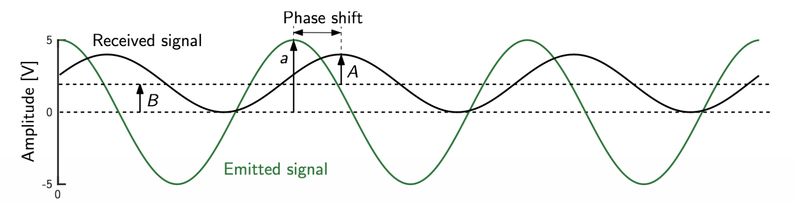
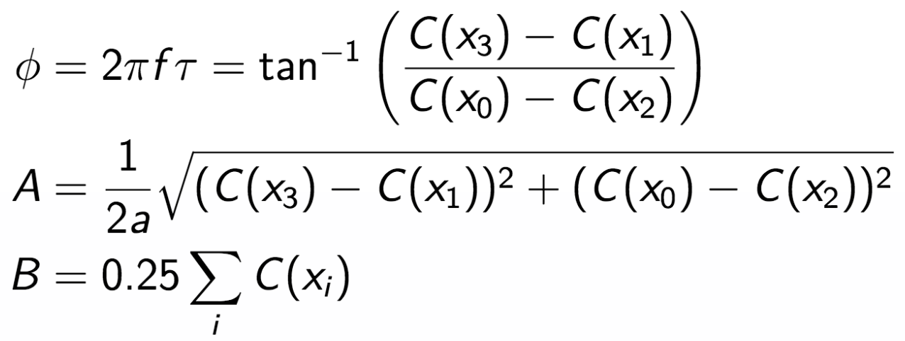
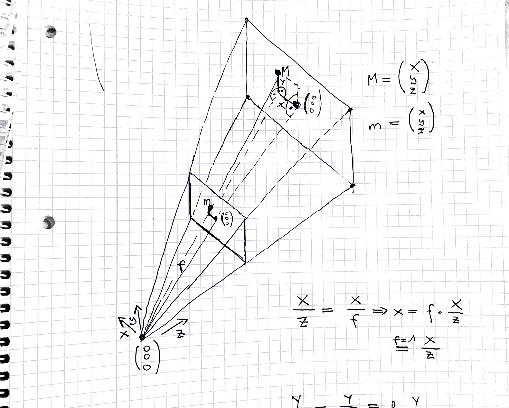
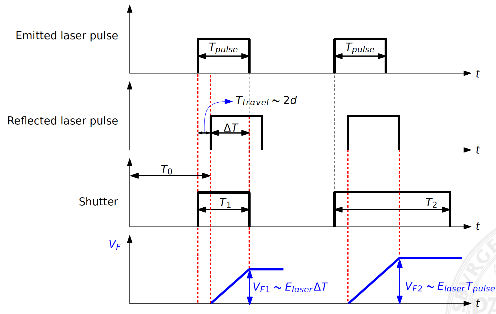

## 3D Sensors

Before we start to look into ToF sensors in detail, we first want to take a look at different sensor types and the way how they are used.

In general, 3D sensors try measure depth based

- on illuminating the scene with a controlled light
- then measuring the backscattered light

We mainly differentiate between two different classes of sensors:

- **Time of Flight (ToF) sensors**  
  Measure depth by estimating the time delay from light emission to light detection. So, this sensor type can really measure distances directly. Typically very expensive. Popular in the field of autonomous driving. 
- **Projected-light sensors**  
  Combine the projection of a light pattern with a standard 2D camera and measure depth via triangulation. Hard to use when it comes to difficult light conditions (ambient light, etc.).
  
  
### Time of Flight Sensors

We can roughly differentiate between two different types of sensors:

- **Point-weise ToF sensors**  
  Get mounted on a two-dimensional pan-tilt scanning mechanism. Also referred as LIDAR (Light Detection and Ranging). Measures the scene point-wise.
- **Matricial ToF sensors**  
  Estimate depth in a "single shot" using a matrix of ToF sensors. In practice, CMOS or CCD image sensors coupled with a lens system are used.

        Matricial ToF      |      Point-wise ToF
:-------------------------:|:-------------------------:
 | 

### Problems with Direct ToF

In Direct ToF we directly measure the time that the signal travels. So, our emitter sends out a light pulse, this light pulse gets reflected by the object and once the reflection gets captured by the sensor we measure how much time has passed.  

Since light travels the speed of light, we can calculate the distance as follows:

$c = \frac{ct}{2}$ where $c=10 \cdot 10^8$ (speed of light)

However, speed of light is also the reason why we cannot perform such measurements with standard hardware. Just think about how much time the signal needs to cover a 1mm path. Approx. 3.3 ps!  
This is far beyond what today's standard computers can do! Special hardware is required to capture such a signal which is extremely expensive.

Also, this approach is typically time-consuming since we can only measure on point at time. Capturing multiple signals at the same time requires multiple detectors which again would result in a significant increase in cost.

Therefore, this approach is NOT used for autonomous driving. However, it can be used to create high-resultion 3D models of rooms, objects, etc. since capturing such models is usually not time-critical.

**Advantages**  
- High energy light pulses can be used (less influence of background information)  
- Illumination and observation directions are collinear (emitter and detector are immediately next to each other; no problems with reflections since the signal comes back stronger)

**Disadvantages**  
- Arrival time must be measured perfectly  
- Needs short light pulses with fast rise/fall times  
- High optical power  
- Typically use laser or laser diodes

### Continuous Wave Modulation

Another approach is to send out a signal of very high frequency (20 MHz). Once the signal gets reflected we will measure a phase shift. This phase shift is proportional to the distance.  
So, at the end what we do is an amplitude modulation.

Let's introduce it by means of an example:

Let's say we send out a signal (emitted signal) and after a while the signal comes back (received signal). If we plot the signal, we would get something as follows:

We now not only observe that the phase changed, we also observe that there is an additional bias B due to ambient light and that the amplitude A became less.

Therefore, we can model our two signals as follows:

$s(t) = a \cdot cos(2 \pi ft)$

$r(t) = A \cdot cos(2 \pi f (t - \tau)) + B$

We can now compare both signals using cross-correlation.

$C(x) = \int_{-\infty}^{\infty} s(x) \cdot r(x+\tau) dt$

If we solve it using Fourier transform, we finally get:

$C(x) = \frac{aA}{2} \cdot cos(2 \pi f \tau + 2 \pi fx) + B = \frac{aA}{2} \cdot cos(\phi + 2 \pi fx) + B$

So, let's again summarize what parameters we know from our equation. Since we can choose an position from our signal we know x. So, the only thing we don't know is $\phi$, A and B. So, if we came up with at least three equations, we could set up an equation system and solve it.

To do that we look at the signal at equally spaced intervals. This algorithm is also called the **4-bucket-algorithm**.

For example:

$2 \pi f x_0 = 0^\circ$  
$2 \pi f x_1 = 90^\circ$  
$2 \pi f x_2 = 180^\circ$  
$2 \pi f x_3 = 270^\circ$

We can then derive the following solutions to the problem:

Finally, we can compute the distance:

$d = \frac{1}{2} \tau c = \frac{1}{2} c \frac{\phi}{2 \pi f} = \frac{c}{2f} \frac{\phi}{2 \pi}$

**Problems with this approach**

Once $\phi$ becomes larger then $2 \pi$ we run into problems since we won't be able to differentiate between certain distances. This **ambiquity** is also called **phase wrapping**.

**Note:** In general, continuous wavelet modulation tends to make a larger error than pulse light modulation.

### From depth to Euclidean coordinates

We now know how to detect and capture and measure the distance to an object. However, we haven't discussed how to map the distance measure for a certain pixel value to real-world coordinates. Therefore, let's take a look at the pinhole camera model and come up with an equation that allows us to map image coordinates to real-world coordinates.

First, we need to know that every camera can be described by its intrinsic camera matrix. This matrix allows us to map between camera coordinates and pixel coordinates in the image frame.

**Note:** The intrinsic camera matrix is always **invertible**. This will come in handy later on!

Now, let's consider the pinhole camera model.

By utilizing the triangle equations we can come up with the following relationships:

$\frac{X}{Z} = \frac{x}{f} => x = f \cdot \frac{X}{Z}$

$\frac{Y}{Z} = \frac{y}{f} => y = f \cdot \frac{Y}{Z}$

$\frac{||M||}{Z} = \frac{||m||}{f} ==> \frac{||M||}{||m||} = \frac{Z}{f}$

If we set f to 1, we get:

$x = \frac{X}{Z}$

$y = \frac{Y}{Z}$

$Z = \frac{||M||}{||m||}$

Next, we can rewrite this as matrix equation.

$\begin{pmatrix} X \\ Y \\ Z \end{pmatrix} = Z \cdot \begin{pmatrix} X/Z \\ Y/Z \\ 1 \end{pmatrix} = Z \cdot \begin{pmatrix} x \\ y \\ 1 \end{pmatrix} = \frac{||M||}{||m||} \cdot \begin{pmatrix} x \\ y \\ 1 \end{pmatrix} = \frac{d}{||m||} \cdot \begin{pmatrix} x \\ y \\ 1 \end{pmatrix}$

Ok, let's now summarize what know. We know the ...

- intrinsic camera matrix A
- value of every pixel (u,v)
- focal length
- distance d

From our intrinsic camera matrix A we can compute (x,y,1).

$\begin{pmatrix} x \\ y \\ 1 \end{pmatrix} = A^{-1} \cdot \begin{pmatrix} u \\ v \\ 1 \end{pmatrix}$

Let's use this for a substitution.

$\begin{pmatrix} X \\ Y \\ Z \end{pmatrix} = \frac{d}{||m||} \cdot A^{-1} \cdot \begin{pmatrix} u \\ v \\ 1 \end{pmatrix}$

That's nice, but the question that remains is what's $||m||$ in our case. Well, $||m||$ can be obtained by means of our camera matrix again. Let's say, we denote by p the coordinates of m of pixel (u,v).

Again, we can apply substitution and obtain our final equation:

$\begin{pmatrix} X \\ Y \\ Z \end{pmatrix} = \frac{d}{||A^{-1}p||} \cdot A^{-1} \cdot \begin{pmatrix} u \\ v \\ 1 \end{pmatrix}$

### Distortions

As usual, we also have to cope with various types of distortion:

**Phase Warping**  
Leads to ambiguities in distance measurements. Discussed above

**Non-ideal sinusoid generation and non-instantaneous sampling**
Leads to harmonic distortion in the estimated phase shift. Occurs because our sinusoid generation is not perfect. Also, it's hard to measure a signal at exactly a certain point in time.

**Photon-shot noise**  
Effects the precision of distance measurements. Interestingly, the noise which affects the distance measurement can be approximated by a Gaussian with variance.

$\sigma_d = \frac{c}{4 \pi f \sqrt{2}} \frac{\sqrt{B}}{A}$

where B is the bias an d A the amplitude of our received signal.

So, if A gets larger, the precision improves. On the other hand, if the ambient light increases (B increases), the precision gets worse. However, this is not such a big problem since B is in the square root. So, typically in a high ambient light scenario we "simply" increase A.

Other noise sources are:  
- Thermal noise caused by receiver signal amplifier  
- Noise caused by quantization of the received signal

**Saturation and motion blur**

### Pulse Light Modulation

We usually prefer Continuous Wave Modulation over Pulse Light Modulation since it's cheaper. However, if we had a lot of money, we could also purchase a system using pulse light modulation.

**Basic principle**

As already mentioned we send out a light pulse of short duration which gets generated by a laser. We then capture the reflection and measure the time delay directly. Of course, to measure such a signal, we need a very fast counter and shutter at to detect the reflected signal. 

One of the major advantages is that the emitter energy is low and we also have no phase ambiquity. Pulse light modulation is typically used for outdoor application, for instance, autonomous driving.

### Double short-time integration

One way to measure the distance is called **double short-time integration** since it used two light pulses to measure the signal.

To understand what happens let's take a look at the following diagram:

**First light pulse:**  
We open the shutter at exactly the time when we emit the laser pulse. Once the signal comes back it hits the CMOS sensor and gets converted into voltage until we close the shutter which closes exactly the end of the pulse time.

**Second light pulse:**  
We open the shutter at exactly the time when we emit the laser pulse. However, the shutter remains open for some time even when we've stop emitting the signal.

Hence, we can argue that the output voltage is proportional to the number of photons reaching the detector. We now can come up with the following relationship:

$V_{F1} \propto E_{Laser} \Delta T$  
$V_{F2} \propto E_{Laser} T_{Pulse}$

Hence, we can write:

$\frac{V_{F1}}{V_{F2}} \propto \frac{\Delta T}{T_{Pulse}} => \Delta T = \frac{V_{F1}}{V_{F2}} T_{Pulse}$

Furthermore, we know that:

$\Delta T = T_{Pulse} - T_{Travel}$

We can now use this information to compute the distance d.

$d = \frac{c}{2} T_{Travel} = \frac{c}{2} (T_{Pulse} - \Delta T) = \frac{c}{2} T_{Pulse} (1 - \frac{V_{F1}}{V_{F2}})$

Finally, we can also calculate the maximum distance that's measureable by the sensor ($T_{Pulse} = T_{Travel}$):

$d_{max} = \frac{c}{2} T_{Pulse}$

**How can we increase the measurable distance?**

Well, the first idea would be to simply increase the shutter time. Unfortunately, this does not work since our image would be totally white (over-exposure) and we would also run into problems with motion blur.

Therefore, we typically apply the following strategy:

1. Increase duration of $T_{Pulse}$
2. Delay between pulse and opening of shutter (leading to $d_{min}$ > 0). However, we get a blind zone.  

  In this case we get:
  
  $d_{max} = \frac{c}{2}(T_{Delay} + T_{Pulse})$ and a blind zone $d_{min} = \frac{c}{2} T_{Delay}$
  
**Note:** In practice, we typically perform multiple measurements n and accumulate resulting voltages.  
This increases SNR and range accuracy by $\sqrt(n)$