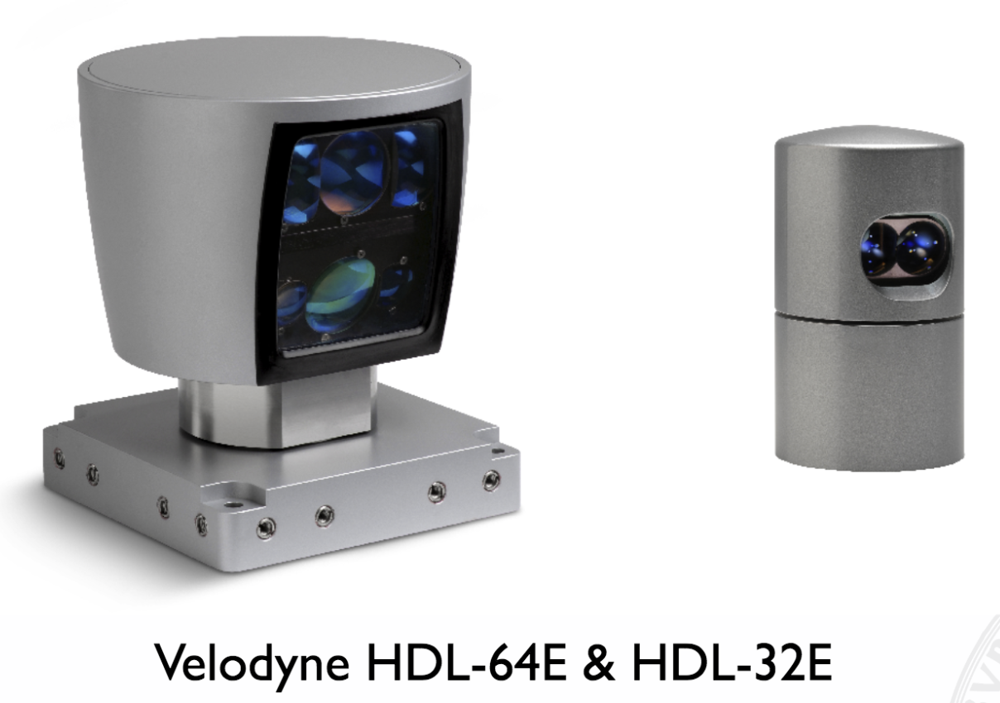
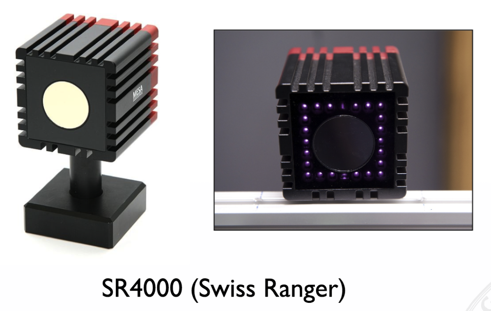
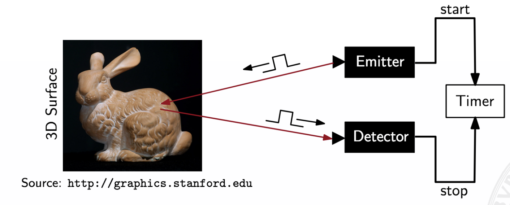
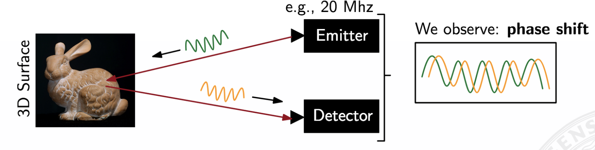

## 3D Sensors

Before we start to look into ToF sensors in detail, we first want to take a look at different sensor types and the way how they are used.

In general, 3D sensors try measure depth based

- on illuminating the scene with a controlled light
- then measuring the backscattered light

We mainly differentiate between two different classes of sensors:

- **Time of Flight (ToF) sensors**  
  Measure depth by estimating the time delay from light emission to light detection. So, this sensor type can really measure distances directly. Typically very expensive. Popular in the field of autonomous driving. 
- **Projected-light sensors**  
  Combine the projection of a light pattern with a standard 2D camera and measure depth via triangulation. Hard to use when it comes to difficult light conditions (ambient light, etc.).
  
  
### Time of Flight Sensors

We can roughly differentiate between two different types of sensors:

- **Point-weise ToF sensors**  
  Get mounted on a two-dimensional pan-tilt scanning mechanism. Also referred as LIDAR (Light Detection and Ranging). Measures the scene point-wise.
- **Matricial ToF sensors**  
  Estimate depth in a "single shot" using a matrix of ToF sensors. In practice, CMOS or CCD image sensors coupled with a lens system are used.

        Matricial ToF      |      Point-wise ToF
:-------------------------:|:-------------------------:
 | 

### Problems with Direct ToF

In Direct ToF we directly measure the time that the signal travels. So, our emitter sends out a light pulse, this light pulse gets reflected by the object and once the reflection gets captured by the sensor we measure how much time has passed.  

Since light travels the speed of light, we can calculate the distance as follows:

$c = \frac{ct}{2}$ where $c=10 \cdot 10^8$ (speed of light)

However, speed of light is also the reason why we cannot perform such measurements with standard hardware. Just think about how much time the signal needs to cover a 1mm path. Approx. 3.3 ps!  
This is far beyond what today's standard computers can do! Special hardware is required to capture such a signal which is extremely expensive.

Also, this approach is typically time-consuming since we can only measure on point at time. Capturing multiple signals at the same time requires multiple detectors which again would result in a significant increase in cost.

Therefore, this approach is NOT used for autonomous driving. However, it can be used to create high-resultion 3D models of rooms, objects, etc. since capturing such models is usually not time-critical.

**Advantages**  
- High energy light pulses can be used (less influence of background information)  
- Illumination and observation directions are collinear (emitter and detector are immediately next to each other; no problems with reflections since the signal comes back stronger)

**Disadvantages**  
- Arrival time must be measured perfectly  
- Needs short light pulses with fast rise/fall times  
- High optical power  
- Typically use laser or laser diodes

### Continuous Wave Modulation

Another approach is to send out a signal of very high frequency (20 MHz). Once the signal gets reflected we will measure a phase shift. This phase shift is proportional to the distance.  
So, at the end what we do is an amplitude modulation.

