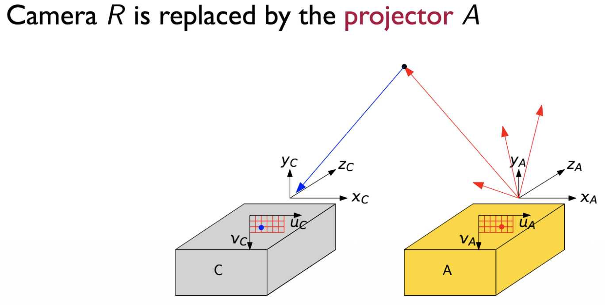
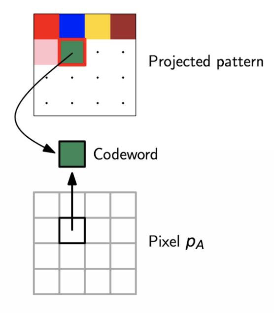

## Structured Light Imaging

We have already discussed how we can measure distance with ToF cameras. Another way of measuring distances is structured light imaging which makes use of two cameras (stereo camera system).

Therefore, to understand how it works, let's first discuss how the ideal binocular stereo setup looks like.
What we want to have are two cameras that are perfectly aligned and face the same direction. If system satisfies this property, we call it **calibried and rectified setup**.  In other words, all epipolar lines have to be parallel to each other. If this is not the case, we always need to come up with a set of "equations" that formally rectify the setup. This is usually done with the well-known checkerboards.

**Note:** We typically one camera **reference camera** and the other one **target camera**.

In a rectified setup the captured images look will somehow as follows:

As we can see both images (cameras) are **coplanar**. In such a setup it's pretty easy to find the corresponding pixel value in the other images. We just have to check the pixels which are on the same line.

### Triangulation

Let's now assume that we have a rectified stereo camera setup with two cameras. The left camera is the reference camera and the right camera the target camera.  We will now perform triangulation to calculate the distance to the point $\begin{pmatrix} X \\ Y \\ Z \end{pmatrix}$.

Now, let's say $p_{L}$ and $p_{R}$ are the corresponding points on our images.

$p_{L} = \begin{pmatrix} u_{L} \\ v_{L} \end{pmatrix}$

$p_{R} = \begin{pmatrix} u_{R} \\ v_{R} \end{pmatrix}$

Furthermore, we call the distance between two corresponding points in an image **disparity**.
Since our setup is rectified, we can simply compute the disparity d as follows: $d_u = u_{L} - u_{R}$. The corresponding pixel will obviously be in the same row.

Now, we need to setup equations that describe our similar triangles.

$x_{L} = f \cdot \frac{X}{Z}$

$x_{R} = f \cdot \frac{X-b}{Z}$

By combining these two equations with the disparity relationship, we can come up with the final equation that allows us to calculate the distance to the object.

$d_x = x_{L} - x_{R} = f \cdot \frac{X}{Z} - (f \cdot \frac{X}{Z} - f \cdot \frac{b}{Z}) = f \cdot \frac{b}{Z}$

$Z = \frac{f \cdot b}{d_x}$

Finally, we can compute the distance vector as follows:

$\begin{pmatrix} X \\ Y \\ Z \end{pmatrix} = Z \cdot A_{L}^{-1} \cdot \begin{pmatrix} u_{L} \\ u_{R} \\ 1 \end{pmatrix}$ 

where A is the intrinsic camera matrix again.

### How to find corresponding points?

We've now discussed how to calculate the distance if we know two points $p_{L}$ and $p_{R}$. However, the question that remains is how to find these corresponding points. Detecting the conjugate pixel pairs is known as the **correspondence problem** in stereo vision and it's typically the tricky part.

In practice, if we are not able to map a certain pixel, we can perform interpolation. However, we need to be aware of the fact that we might introduce errors, for instance, if we want to interpolate the depth-value of pixel that's "sitting" on the corner of an object.

**Note:** In fact, we don't need to have multiple cameras as long as we have an emitter from which we know its exact position. However, such a "problem" can be solved in the exactly the same way as we do it in a stereo setup.

### Light coding system

A **light coding system** is a system in which one of the two cameras is replaced by a projector. The name light coding system arises from the fact that we need to send some "code" for every pixel position.

In practice, we typically want to project a pattern (encode multiple pixels and not just one at the same time) that's not visible for the human eye.

Once we have the distance to every projected point in the real world, we can use this information to generate a disparity (left) and depth map (right).

$z_{min} = \frac{bf}{d_{max}}$

$z_{max} = \frac{bf}{d_{min}}$

### Codeword design patterns

We want to design a pattern that's also decodable in the presence of non-idealities.  
In general, to perform triangulation we need **one codeword per pixel**. The more codewords are different, the better since we get robustness.

However, in a **calibrated + rectified setup** we know that all conjugated points lie on the same horizontal line. This allows us to use a smaller number of codewords since we only need to have unique codewords per row.

In one row, there are $N := p_A^n$ pixels $p_A^1, p_A^2, ..., p_A^n$ to be encoded with codewords $w_1, ..., w_N$.  Therefore, we need a projector with $n_p$ different illumination patterns in a window with $n_w$ pixel. Hence, we have $n_p^w$ possible configurations. N of them need to be chosen to encode the pixels.

Remember,

### Dealing with various artifacts

- **Perspective distortion**  
- **Color distortion**: Due to ambient light  
- **Projector / Camera non-idealities**  
- **Projector / Camera noise**  
- **External illuminations**  
- **Occlusions**: Occurs when we project something on an object, but projection (part of the projection) cannot be seen by the camera since the camera is mounted on a slightly different position.

### Coding Schemes 

There are different ways how to encode pixels...

**Direct coding**

In direct coding every pixel gets encoded differently. This approach is rearly used in praxis. The codeword $p_A$ is the pattern value at the given position. Up to $n_p$ codewords are possible since $n_w = 1$.

**Time-multiplexed coding**

Instead of projecting the pattern once, we project it multiple times. However, every pattern gets encoded differently. This way we can enrich our codeword space. Unfortunately, this approach is more time-consuming and it's also prone to object movements.  
Up to $n_p^T$ codewords where each pattern is projected T times.

**Spatial-multiplexed coding**

A pixel value gets encoded by pixel in its neighbourhood. 

**Note:** As we see in the example below, we can't encode the border region.

### Pixel matching

Ideally, for each pixel $p_c^j$ and each pixel $p_A^i$ in the same row, we obtain a unique **coveriance peak** for an actual couple of conjugate points. The remaining values would be zero (if there was no noise :). Once we know the position in every image, we know the disparity and can calculate the depth map.

**Note:** To find the covarince peak we take one row, slide it across the row of the other image  and compute the cross-correlation.